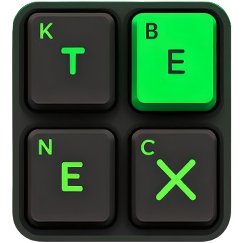

#  Entype 

Welcome to **Entype**, a fun and engaging typing game designed to improve your typing skills! This project offers two exciting game modes: one for practicing English typing and another for practicing coding typing. Whether you're looking to enhance your general typing speed or your coding proficiency, Entype has got you covered.

## Features

- **Two Game Modes**:
  - **English Typing Game**: Practice your typing skills with English text.
  - **Coding Typing Game**: Improve your typing speed and accuracy with code snippets.

- **User-friendly Interface**: Simple and intuitive design to keep you focused on your typing practice.

- **Real-time Feedback**: Get immediate feedback on your typing performance, including speed and accuracy.

## Installation

To get started with Entype, follow these steps:

1. **Clone the repository**:
    ```bash
    git clone https://github.com/RomaruDaze/entype.git
    ```

2. **Navigate to the project directory**:
    ```bash
    cd entype
    ```

3. **Install the dependencies**:
    ```bash
    npm install
    ```

## Usage

To start the game, run the following command in your terminal:

```bash
npm run dev
```

This will launch the Entype application in your default web browser. From there, you can select your preferred game mode and start typing!

## Contributing

We welcome contributions from the community! To contribute to Entype, please follow these steps:

1. Fork the repository.
2. Create a new branch for your feature or bug fix:
    ```bash
    git checkout -b feature-name
    ```
3. Make your changes and commit them:
    ```bash
    git commit -m "Description of your changes"
    ```
4. Push your changes to your fork:
    ```bash
    git push origin feature-name
    ```
5. Create a pull request from your branch to the `main` branch of the original repository.

## License

This project is licensed under the MIT License. See the [LICENSE](LICENSE) file for more details.

## Acknowledgements

Thank you to everyone who has contributed to the development of Entype. Your support and feedback are greatly appreciated.

## Contact

For questions or feedback, please open an issue on the [GitHub repository](https://github.com/RomaruDaze/entype).

Happy typing!


In this code, the image is aligned to the right side of the title using the `float: right;` CSS style. You can adjust the `width` attribute to change the size of the icon as needed.
